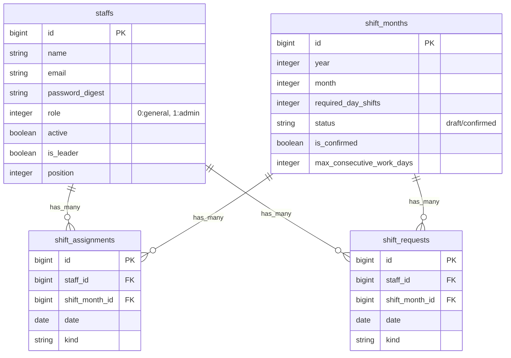

# Shift App (シフト管理アプリ)

## アプリケーション概要
スタッフのシフト管理を効率化するためのアプリケーションです。
管理者がシフト枠を作成し、スタッフが希望を提出、管理者が調整・確定するというフローをデジタル化し、コミュニケーションコストと作成の手間を削減します。

## URL
[デプロイ済みのURLをここに記載してください]

## テスト用アカウント
*   **管理者用メールアドレス**: `admin@example.com`
*   **パスワード**: `password123`

## 利用方法
1. **スタッフ登録**: 管理者がスタッフを登録します。
2. **シフト月作成**: 管理者が対象月（例: 2026年2月）のシフト枠を作成します。
3. **希望提出**: スタッフはログインし、自身のシフト希望（出勤可・不可など）を入力します。
4. **シフト調整**: 管理者は集まった希望をもとに、自動生成機能なども活用しながらシフト割り当てを行います。
5. **確定・共有**: シフトを確定し、スタッフに共有（PDF出力や画面確認）します。

## アプリケーションを作成した背景
従来の飲食店や小売店でのシフト管理は、紙やLINEでのやり取りが主で、転記ミスや調整の連絡コストが大きな負担となっていました。
この課題を解決するため、希望提出から確定までを一元管理でき、かつ「休日設定」や「必要人数」などの条件を考慮したシフト作成を支援するシステムを開発しました。

## 実装した機能についての画像やGIFおよびその説明
*   (画像配置) **シフト希望入力画面**: カレンダー形式で直感的に「休み」「出勤」を選択できます。
*   (画像配置) **シフト管理画面**: スタッフごとの希望一覧に合わせ、ドラッグ＆ドロップ等は（もしあれば）で直感的に調整可能です。

## 実装予定の機能
*   LINE通知機能（シフト確定時や提出期限前）
*   スタッフごとのスキルレベル管理と、それに基いた自動割当ロジックの強化

## データベース設計


## 画面遷移図
```mermaid
graph TD
    Login[ログイン画面] -->|認証成功| Root{トップページ<br>(シフト月一覧)}
    Root -->|管理者| StaffIndex[スタッフ一覧]
    Root -->|選択| ShiftShow[シフト詳細/編集画面]
    
    StaffIndex --> StaffNew[スタッフ登録]
    StaffIndex --> StaffEdit[スタッフ編集]

    ShiftShow -->|希望提出| MyRequests[自分の希望提出]
    ShiftShow -->|管理者| ShiftAdjust[シフト調整]
    ShiftShow -->|管理者| PDFExport[PDF出力]
```

## 開発環境
*   **言語**: Ruby 3.2.0
*   **フレームワーク**: Ruby on Rails 7.1.0
*   **データベース**: PostgreSQL
*   **インフラ**: Render
*   **主なライブラリ**:
    *   `puma`: Webサーバー
    *   `importmap-rails`, `stimulus-rails`, `turbo-rails`: フロントエンド
    *   `holiday_japan`: 祝日判定
    *   `prawn`: PDF生成

## ローカルでの動作方法
```bash
# リポジトリのクローン
git clone [リポジトリURL]
cd shift_app

# ライブラリのインストール
bundle install

# データベースの作成・マイグレーション・初期データ投入
bin/rails db:create
bin/rails db:migrate
bin/rails db:seed

# サーバー起動
bin/rails s
```
これでの `http://localhost:3000` にアクセスしてください。

## 工夫したポイント
*   **重複データの自動クレンジング**: デプロイ時に発生したユニーク制約エラーに対し、モデルに依存しないSQLを用いた安全なマイグレーションを作成し、データ整合性を保ちました。
*   **直感的なUI**: `holiday_japan`を用いて日本の祝日を考慮したカレンダー表示を実装しています。

## 改善点
*   **モバイル対応**: スマホからの操作性をより向上させるためのUI改修が必要です。
*   **テストの拡充**: 主要なロジックにはテストがありますが、E2Eテストなどを増やして信頼性を高めたいと考えています。

## 制作時間
約XX時間